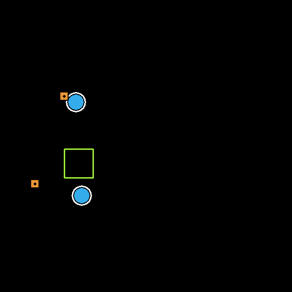
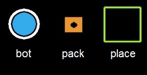
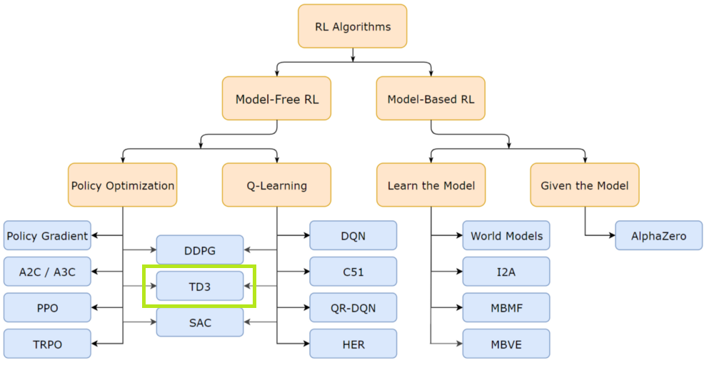

# Multiple entity logistics and continuous space coordination using deep reinforcement learning

Quick preview: 

### Problem definition:
Given a number of autonomous mobility entities create a single neural network that can infer their next required positions in order to solve a reward based environment.  
The environment consists of a number of <strong>"Bots"</strong>, <strong>"Packs"</strong> and <strong>"Places"</strong> located at different positions in a <strong>continuous</strong> 2D space.  
  

Bots can pick up packs when they are in close proximity to them. 
Bots can drop packs when they are in close proximity to the corresponding places. 
"Heading" - coordinate vector that provides the bots their new destination. The bots can navigate to the heading coordinates autonomously. 
The agent is a single policy neural network that generates a new heading vector for any specific state of the environment in order to complete the task. 
During training the agent receives 50 points reward if a bot picks up a pack and 100 points reward if the pack is delivered to the corresponding place, ex: for 2 bots, 2 packs and 1 place the maximum total reward is 300.  
The problem is considered solved if the swarm agent can obtain a reward average over 95% of maximum total reward over a span of 100 episodes

### Policy network implementation:

The input to the policy network consists of a stack of consecutive environment states. 
The environment state consists of positional and logistic values:
- x,y position values for bots
- "bot full" flags, 0 or 1 if full
- x,y position values for packs
- "loaded in" pack logistic index (bot index)
- "unloaded in" pack logistic index (place index)
- x,y position values for places
- heading values form the previous state (logistic "memory")

The policy output is the next heading vector consisting of x,y coordinates for all bots.

### Training the policy network

The policy network is trained using "Twin Delayed Deep Deterministic Policy Gradients" - TD3, an actor-critic method 
derived from "Deep Deterministic Policy Gradients" - DDPG, that uses a second critic network in order to prevent
value over estimation.  

An off-policy method was chosen due to sample efficiency:

Original TD3 Paper: [Addressing Function Approximation Error in Actor-Critic Methods](https://arxiv.org/pdf/1802.09477.pdf)  

TD3 specific critic implementation details:
    
    # Compute target Q values for both critic networks:
    target_q1, target_q2 = self.critic_target(next_state, next_action)
    
    # Choose the minimum target Q value to prevent overestimation error:
	target_q = torch.min(target_q1, target_q2)
	
	# Apply the Bellman equation:
	target_q = reward + not_done * self.discount * target_q

    # Compute current Q values:
	current_q1, current_q2 = self.critic(state, action)
	
	# Compute the critic loss:
	critic_loss = functional.mse_loss(current_q1, target_q) + functional.mse_loss(current_q2, target_q)
	
	# Optimize the critic
    self.critic_optimizer.zero_grad()
	critic_loss.backward()
	self.critic_optimizer.step()
	
TD3 specific actor implementation details:
	
	# Delayed policy updates - the actor is updated less frequently:
	if self.total_it % self.policy_freq == 0:
	
	    # Compute the actor loss by propagating through one of the critic networks:
	    actor_loss = -self.critic.q1(state, self.actor(state)).mean()
		
	    # Optimize the actor:
	    self.actor_optimizer.zero_grad()
	    actor_loss.backward()
	    self.actor_optimizer.step()