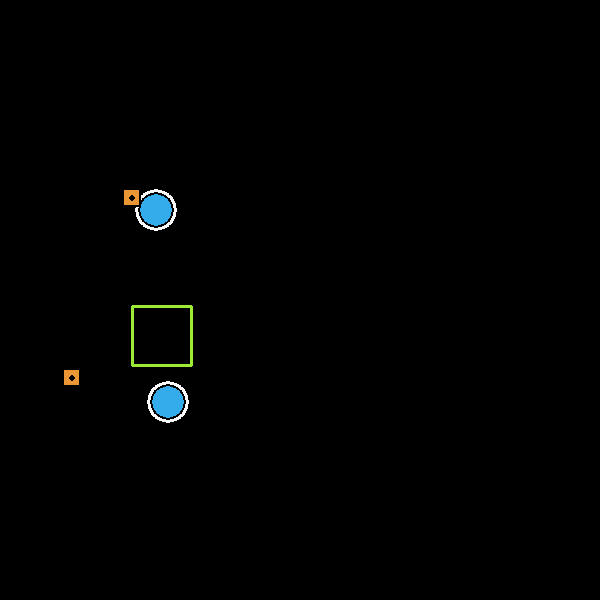

# Multiple entity logistics and continuous space coordination using deep reinforcement learning

### Problem definition:
Given a number of autonomous mobility entities create a single neural network that can infer their next required positions in a specific logistic reward based environment. 

### Implementation details:
The environment consists of a number of "Bots", "Packs" and "Places" located at different positions in a continuous space. 
"Bot" - representation of an autonomous vehicle, can be a car(Uber/Robotaxi), drone, construction robot or any entity that can move to a given position in order to accomplish a task. 
"Pack" - representation of cargo, a person, construction material or anything that needs to be transported to a certain destination. 
"Place" - where the pack needs to end up, the destination. 
Bots can pick up packs when they are in close proximity to them. 
Bots can drop packs when they are in close proximity to the corresponding places. 
"Heading" - coordinate vector that provides the bots their new destination. 
"Swarm agent" - A single policy neural network that generates a new heading for any specific state of the environment in order to complete the task. 
During training the swarm agent receives 50 points reward if a bot picks up a pack and 100 points reward if the pack is delivered to the corresponding place, ex: for 2 bots, 2 packs and 1 place the maximum total reward is 300. 
